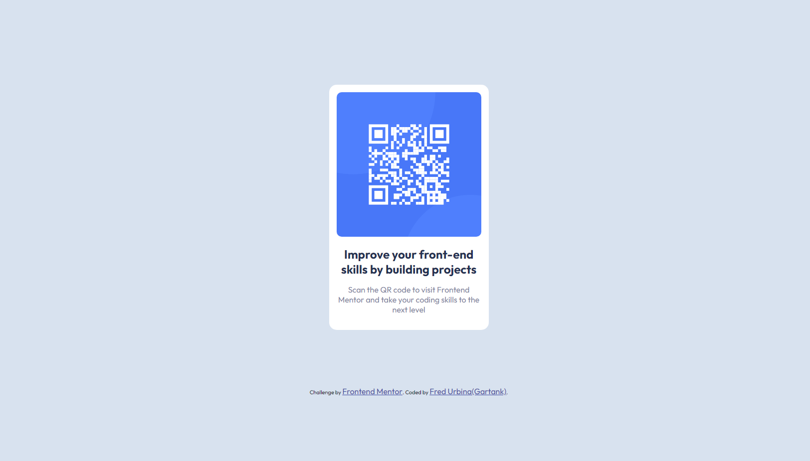

# Frontend Mentor - QR code component solution

This is a solution to the [QR code component challenge on Frontend Mentor](https://www.frontendmentor.io/challenges/qr-code-component-iux_sIO_H). Frontend Mentor challenges help you improve your coding skills by building realistic projects.

## Table of contents

- [Overview](#overview)
  - [Screenshot](#screenshot)
  - [Links](#links)
- [My process](#my-process)
  - [Built with](#built-with)
  - [What I learned](#what-i-learned)
  - [Continued development](#continued-development)
- [Author](#author)

## Overview

### Screenshot

### Links

- Solution URL: [My solution](https://github.com/Gartank/qr-code-component)
- Live Site URL: [Live site](https://gartank.github.io/qr-code-component/)

## My process

### Built with

- HTML5
- CSS
- Flexbox
- Mobile-first workflow

### What I learned

One of the best learnings was the deploy, I've never doing that before and I'm really proud of it. Ommiting that, I learned how to use media queries properly and was a funny stuff for me. Nothing relevant on it but it was so funny.

### Continued development

I want to go further on media queries, because it's a core tool in responsive design.

## Author

- Website - [Fred Urbina](https://github.com/Gartank/)
- Frontend Mentor - [@Gartank](https://www.frontendmentor.io/profile/Gartank)
- Twitter - [@yourusername](https://www.twitter.com/yourusername)
